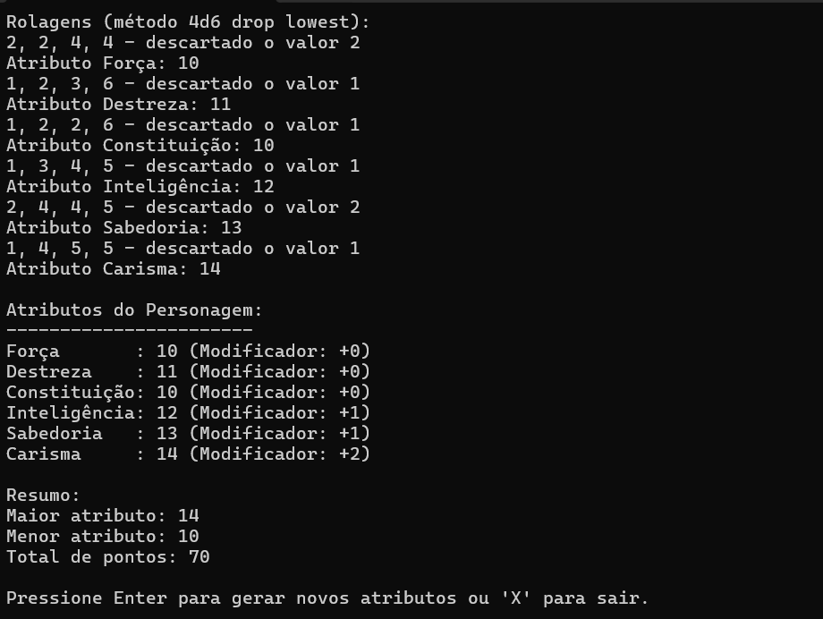

# PersonagemDnD
Exercício `PersonagemDnD`

No clássico RPG "Dungeons & Dragons" cada personagem possui 6 atributos, com valores iniciais entre 3 e 18:

- Força (STR), mensurando o poder físico;
- Destreza (DEX), mensurando a agilidade;
- Constituição (CON), mensurando a resistência;
- Inteligência (INT), mensurando o raciocínio e a memória;
- Sabedoria (WIS), mensurando percepção e intuição;
- Carisma (CHA), mensurando a força da personalidade.

Os atributos geram modificadores em rolagens durante o jogo, sendo seu modificador calculado subtraindo 10 do valor de habilidade e dividindo o total por 2 (arredondado para baixo).

Em sua atual 5ª edição, uma das maneiras recomendadas para criação de personagens é o método _4d6 drop lowest_, que consiste em rolar 4 dados de 6 faces ("d6"), descartar o menor valor e somar os restantes, gerando assim valores na faixa correta.

Faça um programa que gere os 6 valores de atributos e os exiba juntamente com seus modificadores. Repita a rolagem caso a soma dos valores mantidos não atinja 70. Apresente o maior e o menor atributos.

Exemplo:

```
--- Gerador de Personagem para D&D Quinta Edição ---

Rolagens (método 4d6 drop lowest):
5, 1, 2, 6, descartado o valor 1
3, 3, 5, 4, descartado o valor 3
5, 2, 2, 3, descartado o valor 2
2, 4, 1, 3, descartado o valor 1
1, 2, 4, 3, descartado o valor 1
2, 1, 3, 6, descartado o valor 1

A soma das rolagens mantidas é 64, portanto é necessário re-rolar.

Rolagens (método 4d6 drop lowest):
1, 5, 2, 3, descartado o valor 1
4, 3, 6, 1, descartado o valor 1
1, 4, 2, 6, descartado o valor 1
5, 4, 2, 3, descartado o valor 2
5, 4, 1, 1, descartado o valor 1
6, 6, 5, 3, descartado o valor 3

A soma das rolagens mantidas é 74, portanto é necessário re-rolar.

Rolagens (método 4d6 drop lowest):
5, 6, 6, 1, descartado o valor 1
1, 4, 4, 6, descartado o valor 1
5, 6, 4, 6, descartado o valor 4
1, 1, 4, 5, descartado o valor 1
6, 2, 6, 2, descartado o valor 2
2, 2, 3, 1, descartado o valor 1

A soma das rolagens mantidas é 79, portanto não é necessário re-rolar.

STR: 17 (+3)
DEX: 14 (+2)
CON: 17 (+3)
INT: 10 (+0)
WIS: 14 (+2)
CHA:  7 (-1)

Os maiores atributos são Força e Constituição e o menor atributo é Carisma.
```

---

## _Screenshot_


## _Download_

Baixe o arquivo abaixo. Descompacte na pasta desejada
[📁 Download do arquivo .zip](dist/PersonagemDnD.zip)

Execute utilizando o comando:
```
dotnet PersonagemDnD.dll

```
Ou, se você estive no Windows, pode dar um duplo clique no icone do programa

## Contribuidores

- [Derik Rocha](https://github.com/yHeyDark)
- [Kawan Weber](https://github.com/Kawank3)
- 
## Agradecimentos 

- [Fatec Rubens Lara](http://fatecrl.edu.br/)
- [Diego Neri](https://github.com/diegoneri)
- [Dev C#](https://github.com/diegoneri/aulas-lp-csharp)

---

Todos os direitos Reservado. Pirataria e Crime
